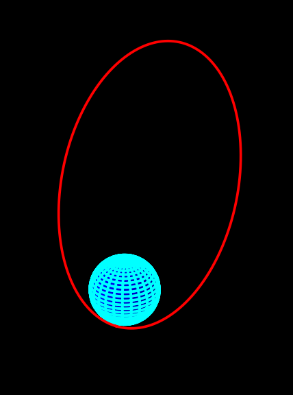
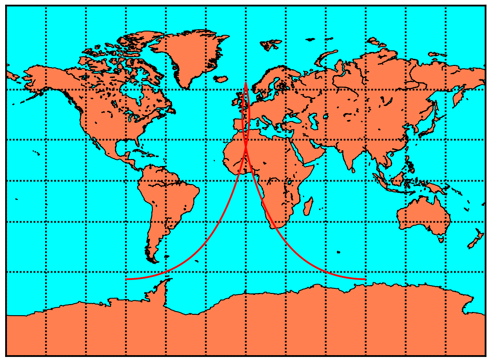

# Simulation of Orbital and Attitude Dynamics for Nano- and Pico-Satellites #

This code simulates a small satellite in orbit around the Earth. It currently includes orbital dynamics described by Kepler's Laws and attitude dynamics for a rigid body.

## Installation ##
A Python 2 distribution is required, along with the packages `numpy`, `matplotlib`, `mpl_toolkits`, `tqdm` and `math`. Something like *Anaconda* is recommended for Windows users.

## Usage ##
To run the simulation, run `RunSim.py` in the Python console. This will define an orbit using the specified orbital elements, simulate it, and plot the results. Orbital elements can be specified manually on line `20` by commenting out lines `27` and `28` or by specifying presets in the file `Presets.py`.

Executing `RunSim` without changes will simulate a satellite in the *Molniya* orbit, producing the following plots.

### 3D orbital path of Molniya orbit ###

### 2D ground track of Molniya orbit ###

## Customisation ##
Earth properties can be edited in `EarthProps.py`, satellite properties in `SatProps.py` and universal properties in `UniversalProps.py`. The file `OrbitModel.py` describes the behaviour of the satellite in orbit and will likely break if played with. `Plots.py` produces the output plots and will also probably break.

## To do list ##
- [x] Orbital dynamics
- [x] Attitude dynamics
- [x] Basic plots
    - [x] 3D orbital path
    - [x] 2D ground track plot
    - [x] Time histories for satellite attitude
- [ ] Environmental disturbances
    - [ ] Aerodynamic moment
    - [ ] Magnetic torque
    - [ ] Gravity gradient torque
    - [ ] J2 gravitational effects
- [ ] Sensor systems
    - [ ] Rate gyroscopes
    - [ ] Magnetometer
    - [ ] Sun sensor 
- [ ] Control actuators
    - [ ] Thrusters
    - [ ] Magnetotorquer
    - [ ] Reaction wheels
    - [ ] Permamagnets
- [ ] Software
    - [ ] Control system
- [ ] Animations
    - [ ] Orbit animation
    - [ ] POV near satellite animation